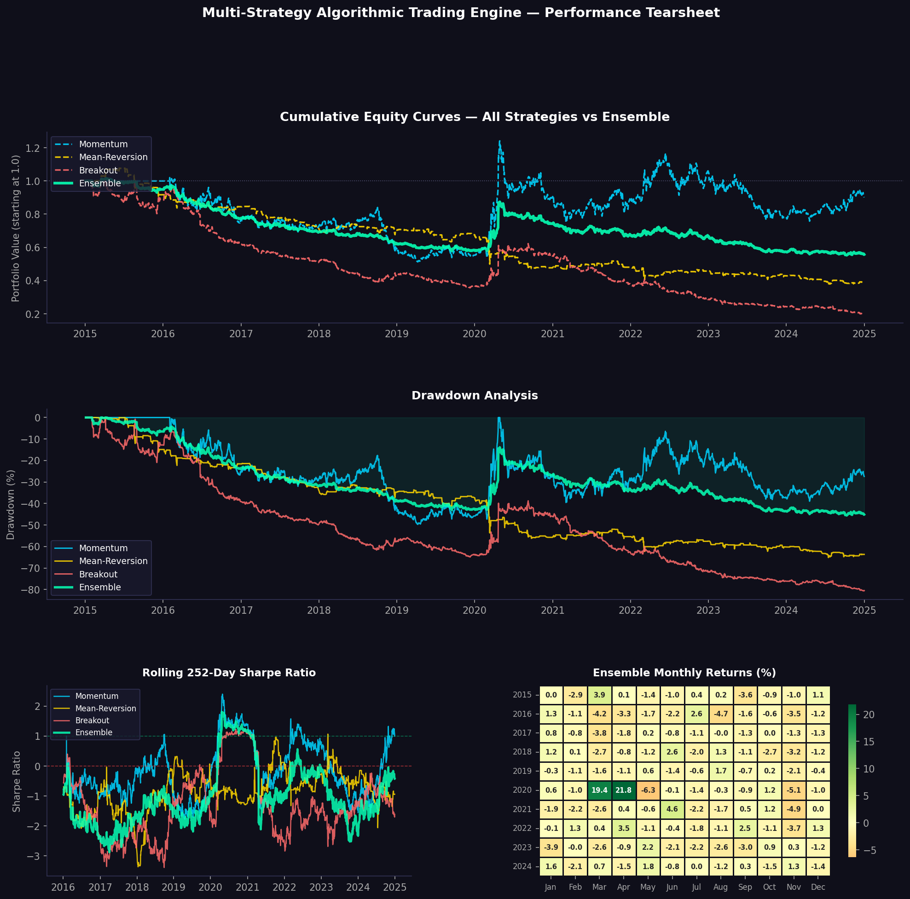

# Multi-Strategy Algorithmic Trading Backtesting Engine

## Project Overview

A reusable, production-style systematic trading research platform implementing three distinct trading strategies — Momentum, Mean-Reversion, and Breakout — within a single unified backtesting framework. Strategies are combined into an ensemble portfolio with full performance analytics and an institutional-grade tearsheet dashboard.

## Strategies Implemented

- **Momentum** — 12-1 month cross-sectional momentum; long top third of assets, short bottom third, rebalanced monthly
- **Mean-Reversion** — RSI + Bollinger Band signal; buy oversold assets (RSI < 30), sell overbought (RSI > 70)
- **Breakout** — Donchian Channel; long on new 20-day highs, short on new 20-day lows
- **Ensemble** — Equal-weight combination of all three strategies to diversify across market regimes

## Key Features

- Reusable backtesting engine — any strategy plugs in via a standardised signal interface
- Lookahead bias prevention — all signals shifted forward by one day before execution
- Transaction cost modelling — 10bps per trade applied to all strategies
- Full performance analytics — Sharpe, Sortino, Calmar, max drawdown, turnover

## Technologies Used

- **Python** — pandas, numpy, matplotlib, seaborn
- **Yahoo Finance** — 10 years of daily price data across 8 diversified ETFs

## How to Run

1. Open `Multi_Strategy_Trading_Engine.ipynb` in Google Colab
2. Run all cells sequentially from top to bottom
3. Note: Cell 4 (Momentum) takes 1-2 minutes — this is expected
4. Tearsheet and performance summary are saved automatically

## Resume Description

*"Built a multi-strategy algorithmic trading backtesting engine in Python implementing Momentum, Mean-Reversion, and Breakout strategies within a unified reusable framework; computed full performance analytics including Sharpe, Sortino, and Calmar ratios with transaction cost modelling, producing an institutional-style strategy tearsheet."*

## Potential Upgrades

- Walk-forward validation to confirm out-of-sample performance
- Risk-parity position sizing weighted by strategy volatility
- Add a fourth ML-based signal (gradient boosting on technical features)
